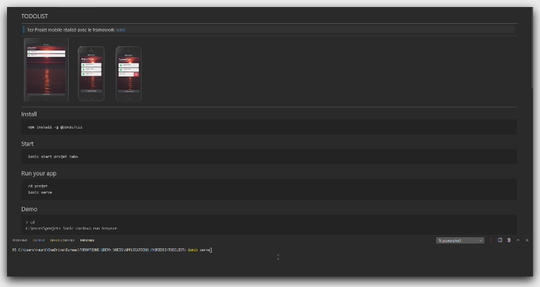

## TODOLIST
***
> ### 1er Projet mobile réalisé avec le framework [ionic](https://ionicframework.com/)
***

 

***
## Install
     npm install -g @ionic/cli
## Start
     ionic start projet tabs
## Run your app
     cd projet
     ionic serve
## Demo
    > cd 
    C:\Users\projet> ionic cordova run browser
  ***

    

